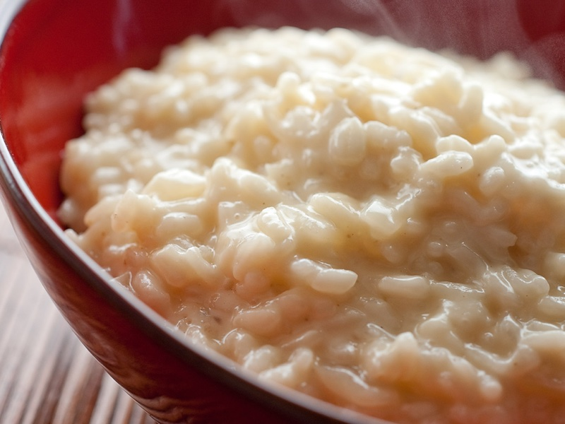

# Bases du risotto

## Préparation

- Chauffer le bouillon.
- Faire suer à feu doux l'oignon ou les échalotes sans coloration avec un peu de matière grasse -beurre ou huile d'olive.
- À feu moyen, ajouter le riz et bien mélanger : les grains de riz doivent « nacrer » c'est-à-dire s'enrober de matière grasse et devenir translucides.
- À feu moyen, verser le vin et déglacer en remuant le riz jusqu'à absorption complète.
- Commencer alors à ajouter le bouillon bien chaud par 1 à 2 louches : remuer jusqu'à complète absorption. Recommencer à ajouter le bouillon chaud tout en remuant et poursuivre ainsi pendant 18 à 20 minutes. À cette étape, vous pouvez intégrer les ingrédients spécifiques à votre recette.
- Lorsque le riz est cuit : il est brillant, moelleux tout en étant un peu ferme à l'intérieur. Mélanger toujours.
- Lier le risotto : hors du feu, ajouter une noisette de beurre ou une cuillère de mascarpone, rectifier l'assaisonnement. Couvrir le faitout et laisser le risotto pendant 3 à 5 minutes au repos.

## Conseils

- Un riz spécifique pour le risotto : il faut une variété de riz particulière qui, à la fois, perd une partie de son amidon et absorbe une grande quantité de liquide tout en restant ferme. Le riz italien est le seul à répondre à ces critères. Il existe plusieurs variétés de riz pour le risotto dont 3 que l'on trouve facilement dans le commerce. Les riz contenant beaucoup d'amidon sont idéalement utilisées :

    + le riz ARBORIO : c'est le plus connu et le plus facile à trouver. Ses grains sont longs, charnus, perlés et tiennent bien à la cuisson. Ils absorbent les saveurs ainsi qu'une grande quantité de liquide sans s'amalgamer. Il cuit entre 15 et 18 mn.
    + le riz CARNAROLI : très apprécié des connaisseurs, ce riz est de plus belle qualité. Les grains sont plus petits que le précédent, ronds, charnus. Riche en gluten, il rend le risotto bien onctueux. Ce riz à une bonne capacité d'absorption tout en conservant une fermeté parfaite à coeur. Il cuit entre 18 et 20 mn. Ce riz à la préférence des Italiens.
    + le riz VIALONE NANO : Ses grains sont petits, ronds et mi-longs. C'est le seul riz à posséder le Label Européen IGP (Indication Géographique Protégée). Il est idéal pour les risottos très crémeux, ses grains pouvant absorber jusqu'à trois fois leur poids en eau. Il cuit entre 15 et 18 mn.

- Les proportions : Il convient de respecter les proportions suivantes pour la réussite du risotto : en plat principal, pour 4 personnes : 300 g de riz, 1 litre de bouillon et 10 cl de vin blanc.
- L'amidon du riz : Il est important de ne pas rincer le riz avant utilisation. En effet, il perdrait alors l'amidon qui donnera l'onctuosité indispensable au risotto.
-  Un faitout à fond épais : Le contenant doit être suffisamment large et haut pour laisser gonfler le riz avec le bouillon ajouté tout au long de la cuisson. Le fond du faitout doit être épais (en fonte de préférence) pour une cuisson homogène du riz sans attacher.
- Une matière grasse de qualité : Idéalement un bon beurre est utilisé ou une bonne huile d'olive dont les parfums vont participer aux saveurs de votre risotto.
- Faire suer oignon, échalotes, ail : à vous de choisir selon vos goûts : généralement un petit oignon jaune ou 2 échalotes sont préconisés dans les recettes de risotto. Vous pouvez également ajouter une gousse d'ail. Avant de verser le riz, faire suer les ingrédients sur feu doux pendant quelques minutes en évitant leur coloration. En Italie, il s'agit là du « soffritto », préparation de base constituée d'un hachis d'oignons, de céleri branche et de carotte, le tout revenu dans de l'huile d'olive.
- Un riz nacré : Bien faire « nacrer » le riz dans la matière grasse : les grains doivent être bien enrobés et devenir luisants. Ils fixeront au mieux les saveurs et tiendront bien à la cuisson. Le risotto est prêt quand les grains de riz ont rendu tout leur amidon.
- Un vin au choix : Un vin blanc sec est le plus souvent utilisé, mais le risotto au vin rouge, au champagne ou au cidre est également possible selon la recette. Il sert à renforcer le goût en apportant de l'acidité.
- Un bon bouillon toujours chaud : La qualité du bouillon ajouté est d'une grande importance ainsi que sa température. Un bouillon « maison » (par exemple d'un pot au feu) est idéal. A défaut, l'utilisation de bouillon déshydraté bio ou surgelé sera plus simple à utiliser : bouillon de volaille pour un risotto à la viande, bouillon de légumes pour un risotto végétarien, fumet de poisson pour un risotto marin…. Le bouillon doit être toujours très chaud. Utiliser une louche pour l'ajouter petit à petit au riz.
- Remuer régulièrement le riz : Le secret d'un risotto très crémeux est de mélanger constamment le riz, en formant un 8. C'est le choc entre les grains de riz qui fait que l'amidon se libère, d'où l'importance de remuer constamment. Le risotto devient progressivement crémeux.
- La cuisson : Le risotto se cuit à feu moyen pendant 18 à 20 mn selon la qualité du riz. Goutter le riz pour vérifier sa tendreté. La texture doit être crémeuse et le coeur du grain de riz encore ferme.
- Le fromage : Plusieurs fromages italiens peuvent agrémenter un risotto. Les préférés :
    + Le Parmigiano reggiano : le plus célèbre des fromages à base de lait de vache, à pâte pressée cuite, affiné pendant 12 mois minimum, au goût fruité et typé.
    + Le Pecorino : ce fromage à pâte pressée a la douceur typique du lait de brebis. Son goût salé et piquant en fonction de l'affinage lui confère un arôme caractéristique.
    + le Gorgonzola : un fromage traditionnel persillé à base de lait de vache. En fonction de l'affinage, sa pâte est fine et douce ou plus piquante et puissante en goût.
- La liaison : En fin de cuisson, il est de règle de lier le risotto : mantecatura. Souvent avec du beurre, du parmesan ou du mascarpone, la liaison se fait à feu éteint en mélangeant le riz. Assaisonner à cet instant et couvrir le faitout. Laisser reposer le risotto de 2 à 5 mn.
- À déguster de suite : Le risotto se prépare et se consomme immédiatement. Il ne tolère pas le réchauffage.
- L'assiette pour un risotto : En Italie, le risotto se sert très chaud dans des assiettes creuses. Il se déguste avec une cuillère ou une fourchette, en rapprochant le riz au fur et à mesure au bord de l'assiette pour le refroidir

## Source
[jardin-des-gourmands.com](http://www.jardin-des-gourmands.com/zoom/reussir-un-risotto-8101.html)
