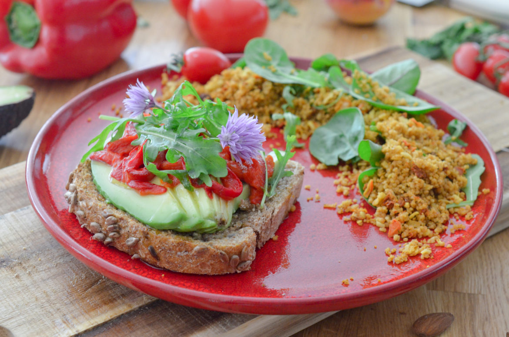

# Avocado toast aux poivrons confits

- Nombre de personnes : 2
- Préparation : 20 min
- Cuisson : 15 min

## Ingrédients

### Pour les tartines

- 2 tranches de pain aux graines
- 1 avocat
- 1 poivron
- 1 gousse d’ail
- 2 cuillères à soupe d’huile d’olive
- Fleur de sel, poivre

### Pour la salade

- 1 poignée de jeunes pousses
- 200g de semoule d’épeautre aux courgettes et aux olives Beendhi
- 100g de tomates cerises
- 2 cuillères à soupe d’huile d’olive
- 1 cuillère à soupe de jus de citron

## Préparation

- Préchauffez votre four en mode grill. Placez le poivron sous le grill et faites-le griller sur toutes les faces, jusqu’à ce qu’il devienne noir (environ 2 minutes par face). Déposez-les dans une assiette et recouvrez d’un morceau de film étirable. Réservez une 10aine de minutes avant de l’éplucher, d’enlever les pépins ainsi que les parties blanches, et de le découper en lanières.
- Dans un bol, recouvrez la semoule d’épeautre d’eau bouillante. Couvrez et laissez gonfler 5 minutes.
- Faites dorer votre pain à l’aide d’un grille pain ou sous le grill du four. Frottez-le avec la gousse d’ail coupée en deux et arrosez d’un filet d’huile d’olive.
- Coupez l’avocat en fines lamelles. Déposez un demi avocat sur chaque tranche de pain, puis déposez des lamelles de poivrons. Arrosez d’un filet d’huile d’olive et parsemez de fleur de sel et d’un tour de moulin à poivre.
- Égrenez la semoule et mélangez avec les pousses de salades, ainsi que l’huile d’olive et le jus de citron. Ajoutez les tomates cerises coupées en deux.
- Servez les tartines avec la salade de semoule d’épeautre.

## Astuces

- Si vous n’avez pas le mélange Beendhi à base de semoule d’épeautre, utilisez de la semoule d’épeautre nature en y ajoutant un peu de cumin, un taboulé ou encore de la semoule classique.
- Pour ajouter une touche de croquant à vos tartines, parsemez de quelques gaines de courge !

## Source

[www.lespepitesdenoisette.fr](https://www.lespepitesdenoisette.fr/les-recettes/avocado-toast-aux-poivrons-confits/)
