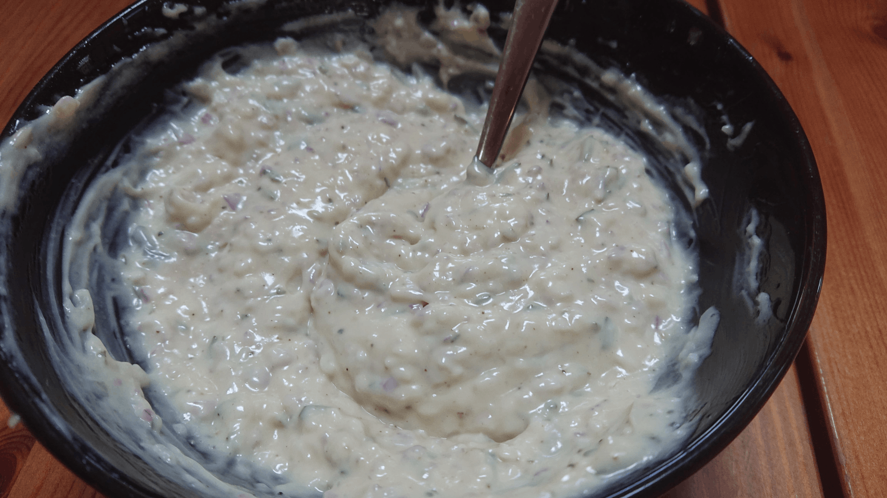

# Béarnaise Manon-officielle

- Nombre de personnes : 6

## Ingrédients

- 1 oeuf
- 1 cuillère à café de moutarde
- 150 ml d'huile (4 huiles, tournesol ou autre neutre)
- 1 cuillère à café de vinaigre
- 0.5 cuillère à café de poivre
- 1 pincée de sel
- 1 oignon rouge
- 1 branche d'estragon (à adapter)

## Préparation

- mixer l'oignon et l'estragon
- dans un bol, mettre le jaune d’œuf avec 1 cuillère à soupe d'huile et la moutarde
- au fouet, mélanger en effectuant un mouvement de rotation afin de mêler la moutarde au jaune d’œuf. Tout en fouettant, ajouter au fur et à mesure l'huile en filet. Continuer jusqu'à que l'huile soit bien incorporée.
- dès que le mélange s'épaissit, assaisonner de sel et de poivre. Au dernier moment versez le vinaigre.
- ajouter le mélange oignon + estragon

## Astuces

- Tous les ingrédients doivent être à température ambiante. 
- Pour une mayonnaise plus aérée, utiliser l’œuf entier. 
- Possible d'assaisonner la mayonnaise avec de l'estragon, du citron, du gros poivre, du curry, etc... (testé et approuvé avec un oignon rouge et de l'estragon)

## Source

[Journal des Femmes](https://cuisine.journaldesfemmes.fr/recette/352600-mayonnaise-maison)