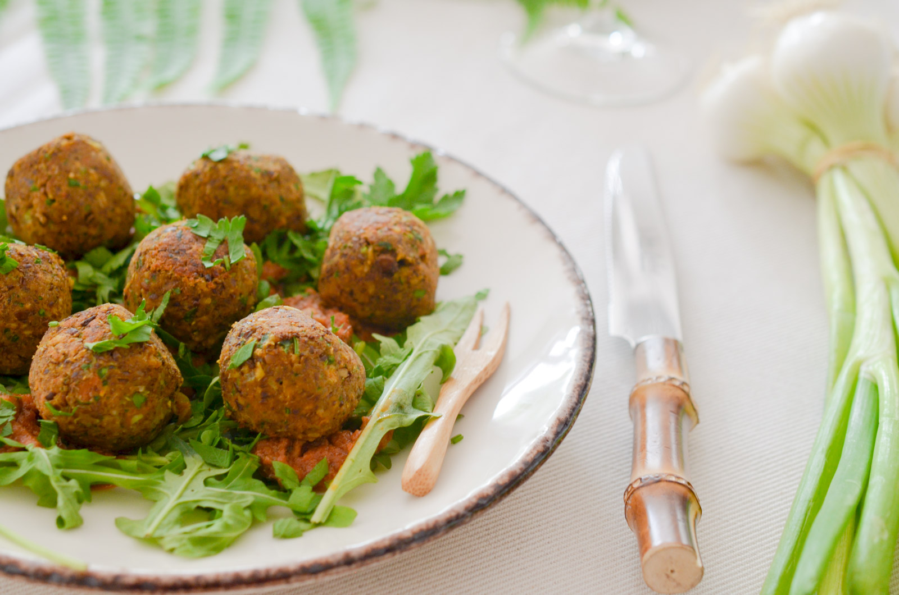

# Boulettes de lentilles à l'indienne

- Nombre de personnes : 4
- Préparation : 20 min
- Cuisson : 30 min

## Ingrédients

### Pour les boulettes aux lentilles

- 1 sachet de préparation aux lentilles et carottes Bjorg
- 1 oignon
- 1 cuillère à café de curry
- 1 cuillère à café de poudre de cumin
- 1 pincée de piment
- 1 gousse d’ail
- 2 cuillères à soupe de persil frais ciselé
- 25g de flocons d’avoine

### Pour le service

- Yaourt
- Chutney

## Préparation

- Dans une poêle avec un filet d’huile, faites revenir l’oignon émincé jusqu’à ce qu’il devienne translucide. Ajoutez l’ail, le curry, le cumin, le piment, une touche de sel et de poivre et poursuivez la cuisson 2 minutes.
- Dans un robot mixeur, versez votre préparation aux lentilles. Ajoutez les oignons aux épices, l’avoine, ainsi que le persil. Formez des boulettes de la taille d’une noix à l’aide de la paume de votre main et réfrigérez 30 minutes.
- Dans une poêle avec un filet d’huile, faites revenir les boulettes jusqu’à ce qu’elles soient bien dorées.
- Servez avec une sauce au yaourt (ou une sauce à base de tomates) et un chutney de fruits.

## Astuces

- Vous pouvez servir ces boulettes aussi bien à l’apéritif qu’en plat principal avec de la semoule, des pâtes, ou encore sur une salade composée.

## Source

[www.lespepitesdenoisette.fr](https://www.lespepitesdenoisette.fr/les-recettes/boulettes-de-lentilles-a-lindienne/)
