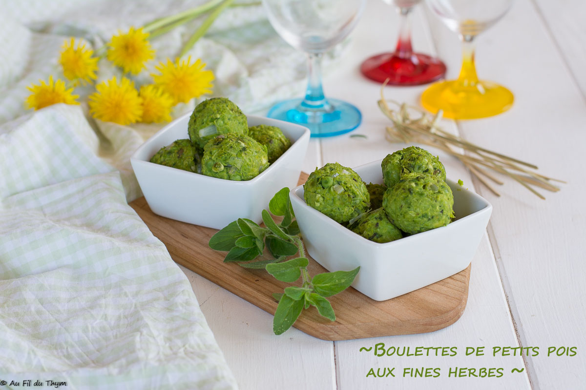

# Boulettes de petits pois à l’origan

- Nombre de personnes : 3
- Préparation : 20 min
- Cuisson : 30 min

## Ingrédients

- 400 gr de petits pois (décossés => environ 1 kg en “frais”, ou surgelés)
- 6-8 brins d’origan (***)
- 1 échalote
- 2 cuillères à soupe d’huile d’olive
- 2 cuillères à soupe de maïzena
- Noix de muscade
- Sel et poivre

## Préparation

- Faites cuire les petits pois 10 à 15 minutes dans de l’eau bouillante, jusqu’à ce qu’ils soient bien tendres. Égouttez soigneusement.
- Entre temps, lavez et hachez les herbes. Épluchez puis hachez l’échalote.
- Disposez les petits pois et l’huile d’olive dans un mixer, sauf 2-3 cuillères à soupe de petits pois (*) que vous garderez à part. Mixez les petits pois finement, jusqu’à obtenir une sorte de pâte. (**) Ajoutez l’huile d’olive, maïzena noix de muscade, sel et poivre et mélangez.
- Incorporez les herbes hachées et l’échalote hachée, les petits pois entiers puis homogénéisez.
- Formez des boulettes que vous disposerez sur une plaque de cuisson four.
- Enfournez pour 20 minutes à 180°C

## Astuces

- (*) Garder quelques petits pois à part permet d’apporter des grains croquants dans la boulette. Ce n’est pas indispensable, mais de mon côté j’aime bien cette différence de texture.
- (**) Si la pâte est un peu trop épaisse et se mixe mal n’hésitez pas à rajouter quelques cuillérées à soupe d’eau.
- (***) Vous pouvez remplacer l’origan par tout herbe de votre choix. Faites juste attention qu’elle va cuire avec les boulettes et donc évoluer en saveur par rapport au goût frais.
- Présentation : Ces boulettes peuvent être (entre autre) utilisées
    + À l’apéritif pour picorer
    + Dans un “bowl veggie” (source de protéines)
    + Dans un plat de pâtes végétarien
    + Et toute autre idée

## Source

[aufilduthym.fr](https://aufilduthym.fr/boulettes-petits-pois-origan-vegetalien/)
