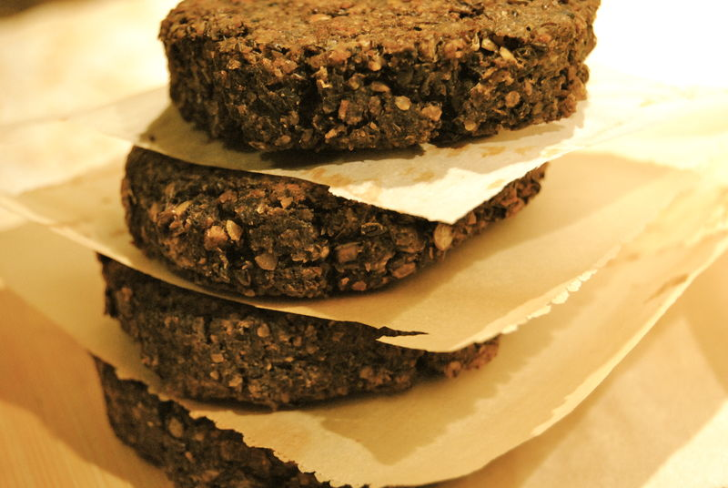

# Burger ou pâté de lentilles, champignons et olives noires

## Ingrédients

- 1 c. à soupe d'huile d'olive
- 1 oignon haché ou 3 échalotes française
- 227g (1 petit casseau) de champignons de votre choix hachés grossièrement
- 3 gousses d'ail écrasées
- Poivre noir du moulin
- 1/2 c. à thé de thym
- 1/4 de c. à thé d'estragon
- 1/2 tasse d'olive kalamata dénoyautées
- 1 1/4 tasses de lentille de Puy cuites ou en conserve
- 1/2 à 1 tasse de chapelure
- 2 c. à table de sauce soja
- 2 c.à thé de jus de citron (personnellement, je mettrai l'acidité dans ma salade de maïs et persil)

## Préparation

- Dans une poêle, revenir dans l'huile l'oignon, l'ail et les champignons.
- Quand les champignons ont évaporé leur eau, ajouter le thym et l'estragon, poivrer.
- Réserver.
- Au robot pulser tous les ingrédients pour avoir une simili purée, garder un peu de texture.
- Façonner 4-6 galettes (ou manger tel quel sur du pain grillé).
- Cuire les galettes au four à 350 degrés F. 10 minutes de chaque côté, sur une plaque recouverte de papier parchemin.
- Accompagné d"une salade de maïs persillé et de frites de pommes de terre en juliennes cuites au four.

## Source

[brutalimentation.canalblog.com](http://brutalimentation.canalblog.com/archives/2011/01/04/20037364.html)
