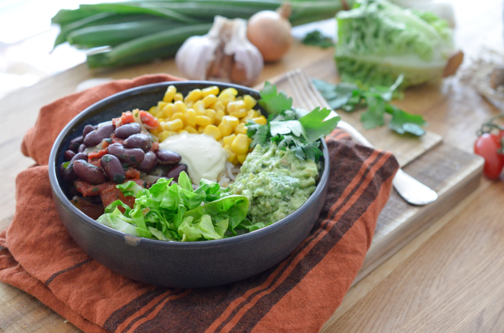

# Burrito bowl végan

- Nombre de personnes : 2
- Préparation : 25 min
- Cuisson : 20 min

## Ingrédients

### Pour le bowl

- 120g de riz
- 100g de maïs
- 100g de haricots rouges
- 1 oignon
- 1 gousse d’ail
- 1 cuillère à café de cumin en poudre
- 1 tomate
- 1 cuillère à café de concentré de tomates
- 1 sucrine

### Pour la purée d’avocat

- 1 avocat
- 1/2 bouquet de coriandre ciselée
- 1 citron vert
- Sel, poivre

### Pour la mayonnaise vegan

- 2 cuillères à soupe de crème végétale
- 4 cuillères à soupe d’huile végétale (colza ou tournesol, olive si vous aimez les arômes prononcés)
- 1 cuillère à soupe de jus de citron vert
- 1 cuillère à café de moutarde forte

## Préparation

- Dans une casserole d’eau bouillante salée, faites cuire le riz 12 à 15 minutes. Égouttez
- Émincez l’oignon et faites-Le revenir dans une poêle. Ajoutez l’ail émincé, le cumin, et le concentré de tomates.
- Coupez la tomate et incorporez à votre poêlé d’oignons. Ajoutez les haricots rouges, du sel et du poivre et laissez mijoter.
- Écrasez la chair d’avocat avec le zeste et le jus de la moitié du citron vert. Incorporez de la coriandre ciselée, du sel, du poivre et réservez au frais.
- Préparez la mayonnaise : à l’aide de fouets électriques, émulsionnez tous les éléments ensemble sauf le jus de citron jusqu’à l’obtention d’une texture crémeuse. Incorporez le jus de citron et réservez.
- Dans vos bols de service, disposez un lit de riz. Ajoutez sur le dessus le maïs, la poêlée de haricots, la purée d’avocat, la sucrine ciselée, et servez avec la mayonnaise.

## Astuces

- Pour ajouter un peu de texture, vous pouvez servir votre bowl avec des pois chiches grillés ou des boulettes de légumes.

## Source

[www.lespepitesdenoisette.fr](https://www.lespepitesdenoisette.fr/les-recettes/burrito-bowl-vegan/)
