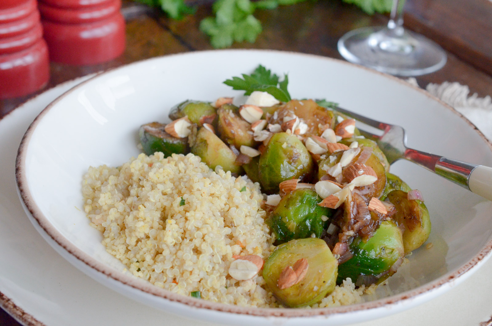

# Choux de Bruxelles poêlés à l'érable et au balsamique

- Nombre de personnes : 4
- Préparation : 10 min
- Cuisson : 10 min

## Ingrédients

- 500g de choux de Bruxelles
- 70g de couscous semi complet
- 1 échalote
- 1 cuillère à soupe de vinaigre balsamique
- 1 cuillère à soupe de sirop d’érable
- 40g d’amandes entières

## Préparation

- Versez le couscous dans un bol, salez, poivrez et ajoutez une cuillère à soupe d’huile d’olive. Versez de l’eau bouillante à hauteur et couvrez.
- Enlevez les premières feuilles des choux de Bruxelles et coupez très légèrement le pied. Dans une grande casserole d’eau bouillante, cuire les choux de Bruxelles coupés en deux 5 minutes. Égouttez-les.
- En attendant, faites revenir l’échalote ciselée avec un filet d’huile d’olive. Incorporez les choux de Bruxelles, le vinaigre et le sirop d’érable 5 minutes, jusqu’à ce qu’ils soient légèrement caramélisés. Salez, poivrez.
- Servez les choux de Bruxelles sur un lit de semoule égrenée, le tout parsemez d’amandes concassées.

## Astuces

- Pour encore plus de saveurs, torréfiez les amandes quelques minutes dans une poêle sèche.
- Déclinez ce plat en y ajoutant quelques cubes de tofu fumé et une poignée de canneberges séchées ainsi qu’une cuillère à soupe de sauce soja : un délice !

## Source

[www.lespepitesdenoisette.fr](https://www.lespepitesdenoisette.fr/les-recettes/choux-de-bruxelles-poelees-a-lerable-et-au-balsamique/)
