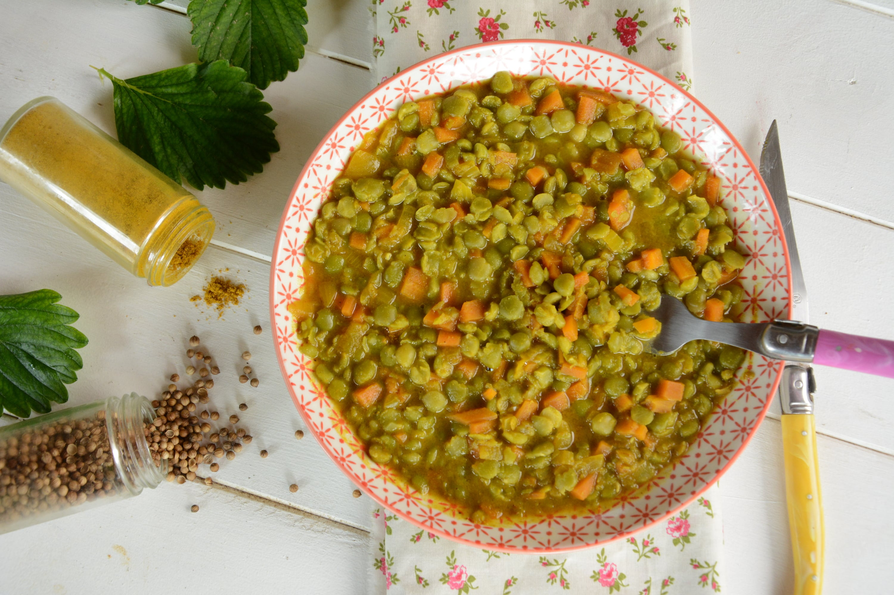

# Dahl de pois cassés

## Ingrédients (pour 4 personnes)

- 250 gr de pois cassés
- 1 oignon
- 2 petites carottes
- 1 gousse d’ail
- 1.5 cuillères à soupe de curry
- 1.5 cuillères à soupe de curcuma
- 1 cuillère à café de cumin moulu
- 1 cuillère à café de coriandre
- 1 cuillère à soupe de moutarde
- Sel et poivre
- Huile d’olive

## Préparation

- Lavez les carottes. Épluchez ail, oignons et carottes puis hachez les finement. Rincez les pois cassés.
- Dans une casserole large, faites chauffer 2 cuillères à soupe d’huile d’olive puis faites revenir les légumes jusqu’à ce que l’oignon soit translucide.
-3 minutes.
- Ajoutez les pois cassés,  couvrez d’eau, couvrez la casserole, puis faites cuire à ébullition pendant 45 minutes à 1 heure (selon 45 min plutôt croquant ou 1H très fondant)
- À l’issue de ce temps, ajoutez la moutarde (*), sel, poivre, mélangez et laissez à feux doux. Servez bien chaud.

## Variantes

- (*) Moutarde ? La moutarde apporte du liant et relève le plat. Si vous préférez quelque chose de plus doux, utilisez de la crème ou du lait de coco à hauteur de 100 à 200ml.
- Gain de temps : Pour préparer un dahl pois cassés rapide, essayez de trouver des flocons de pois cassés (magasin bio), ce qui permet de préparer un plat en 15 minutes.
- Variantes : ajustez les épices selon vos gouts. Vous pouvez par exemple mettre un peu plus de curry, ou ajouter une pointe de piment de Cayenne pour un plat plus relevé.
- Accompagnement : Pour les plus gros appétits servez ces pois cassés avec du riz. Personnellement, j’accompagne plutôt de crudités.

## Source

[aufilduthym.fr](https://aufilduthym.fr/dahl-pois-casses-indienne-vegan/)
