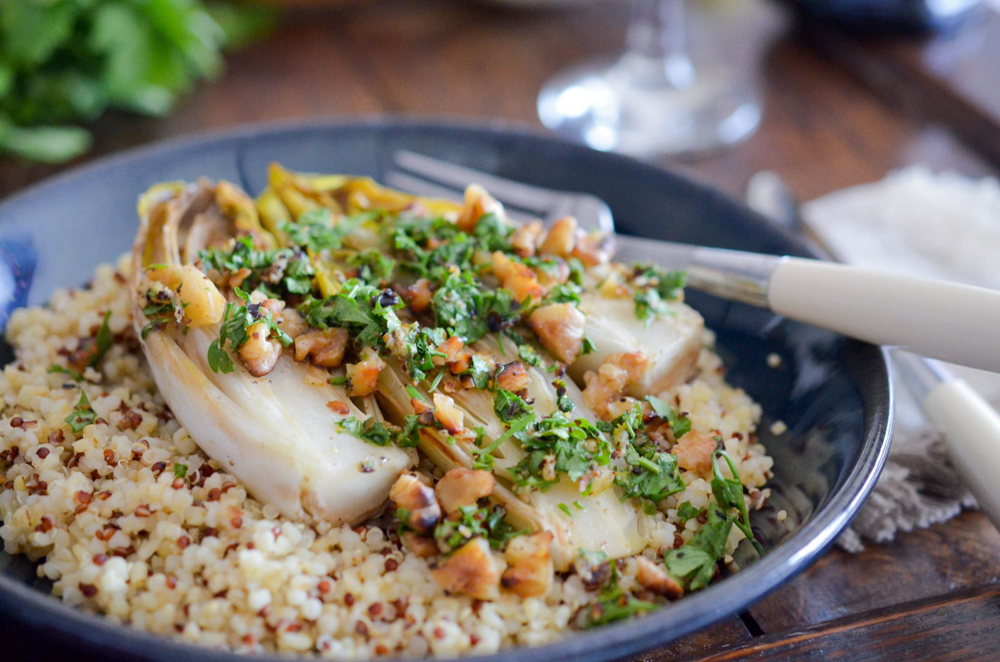

# Endives braisées à la gremolata de noix

- Nombre de personnes : 2
- Préparation : 10 min
- Cuisson : 12 min

## Ingrédients

- 125g de quinoa
- 1 cube de bouillon de légumes
- 3 endives
- 1 cuillère à café de miel
- 1 orange
- 40g de noix
- 1 citron
- 1 gousse d’ail
- 1/2 bouquet de persil
- 2 cuillères à soupe d’huile de noix
- Fleur de sel
- Poivre

## Préparation

- Dans une grande casserole d’eau bouillante, diluez le bouillon de légumes. Ajoutez le quinoa en pluie en cuire 12 minutes.
- En attendant, coupez les endives en deux. Dans une poêle avec un filet d’huile, saisissez les endives sur les 2 faces jusqu’à ce qu’elles soient bien dorées (environ 8 minutes). Ajoutez le miel, les zestes de la moitié de l’orange, une pointe de fleur de sel, du poivre, et baissez le feu.
- Dans un bol, concassez les noix, ajoutez le zeste de citron, l’ail haché, le persil, du sel et du poivre.
- Servez un lit de quinoa, disposez les endives braisées, la gremolata et terminez par un filet d’huile de noix. Accompagnez du citron restant.

## Astuces

- Pour enlever l’amertume des endives, il suffit de couper la base et d’entailler le centre, qui est plus amer que les feuilles. Attention tout de même à ne pas détacher toutes les feuilles de leur base.

## Source

[www.lespepitesdenoisette.fr](https://www.lespepitesdenoisette.fr/les-recettes/endives-braisees-a-la-gremolata-de-noix/)
