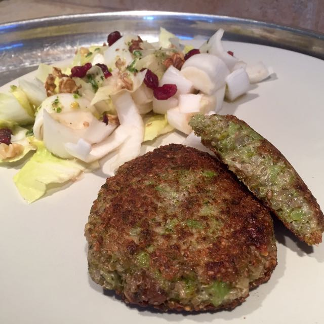

---
tags:
  - galettes
  - Brocoli
  - Quinoa
  - Ail
  - Oignon
  - Herbes fraiches
  - Huile
  - Fécule de pomme de terre
---

# Galettes quinoa et brocolis

## Ingrédients

- 1 Brocoli
- Quinoa - 1 verre
- Ail en poudre - 1 cc
- Oignon en poudre - 1 cs
- Herbes fraiches - 1 poignée
- Sel, poivre - selon le goût
- Huile pour la friture
- Fécule de pomme de terre - 2 cs

## Préparation

- Faites cuire votre brocoli à la vapeur et réserver. Rincer le quinoa et le faire cuire selon les indications du paquet. Écrasez le Brocoli et le quinoa au presse-purée lorsqu'ils sont encore chaud puis ajouter la fécule de pomme de terre, l'ail, l'oignon, les herbes, le sel et le poivre. Mélanger énergiquement et laisser refroidir.
- Former les galettes avec vos mains, et faites les cuire dans une poêle avec un peu d'huile 3-4 mn sur chaque face.
- Vous pouvez également former des boulettes au lieu des galettes et les faire frire dans l'huile.
- Servez en burger, à l'assiette avec des frites et de la mayonnaise végétale, ou avec une petite salade.

## Source

[Tambouille et délices](http://www.tambouilleetdelices.fr/2015/06/20/galettes-de-brocoli-quinoa-vegetal-et-sans-gluten/)
