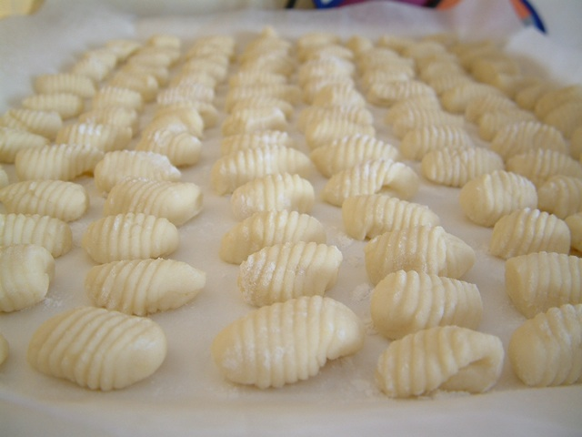

---
tags:
  - gnocchis
  - pomme de terre
  - farine
---

# Gnocchis

## Ingrédients

- 500 g de pommes de terre à gnocchi
- 140 g de farine (celle que vous préférez)

## Préparation

- Mettre les pommes de terre (de préférence vieilles, pas nouvelles) avec la peau dans un fait tout et couvrez-les avec l'eau. Portez à ébullition et laissez cuire jusqu'à ce qu'elles deviennent tendres (tentez-les avec une fourchette). Quand elles seront cuites égouttez les et plongez-les dans de l'eau froide pour réussir à les éplucher sans se bruler les doigts. ;-)
- Passez-les dans l'ustensile pour les écraser et mettez-les dans un grand saladier. Laisser refroidir à la température de la pièce. Ajoutez une petite quantité de farine (il dépend du degré d'humidité aussi), j'en avais mise environ 140 g pour un demi kilo de pdt et c'était suffisante. Mélanger bien farine et pdt. Pas de sel dans le mélange et dans l'eau de cuisson des pdt non plus : il n'est pas nécessaire !
- Prenez de morceaux du pâton et formez des rouleaux en longueur, coupez le rouleau en morceaux longs de 2,5 centimètres. Prenez chaque petit morceau, enroulez-le entre les doigts et passez-le sur “l'étudié pour” lui donner la jolie forme, ou passez-le sur le dos d'une fourchette farinée.
- C'est fait ! Cuisez les gnocchis en beaucoup d'eau salée, où vous aurez versé un filet d'huile, enlevez les de l'eau à fur et à mesure qu'ils remontent en surface et assaisonnez comme vous préférez mieux !

## Source et images

[http://www.veganwiz.fr](http://www.veganwiz.fr/2010/04/08/gnocchi-de-lia/)
