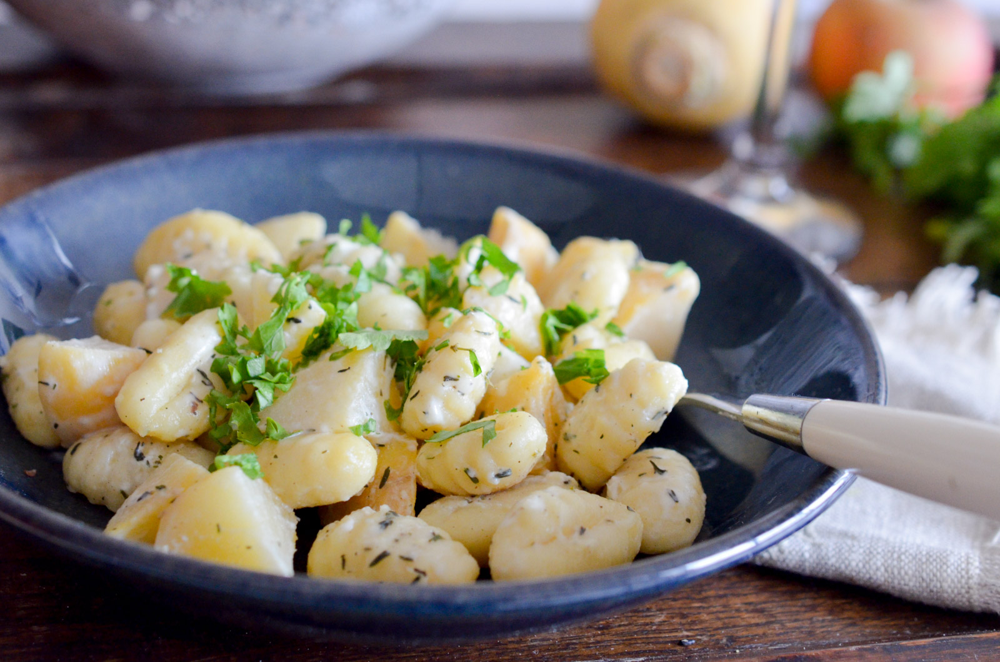

---
tags:
  - de gnocchis à poêler
  - de navets
  - de gingembre
  - cuillère à soupe de miel
  - feuilles de sauge
  - cuillère à café de thym
  - de crème de soja
---

# Gnocchis aux navets caramélisés

- Nombre de personnes : 2
- Préparation : 10 min
- Cuisson : 13 min

## Ingrédients

- 300g de gnocchis à poêler
- 300g de navets
- 3cm de gingembre
- 1 cuillère à soupe de miel
- 4 feuilles de sauge
- 1 cuillère à café de thym
- 10cl de crème de soja

## Préparation

- Épluchez et coupez les navets en cubes. Faites-les cuire 10 minutes dans un casserole d’eau bouillante salée.
- Dans une poêle avec un filet d’huile, faites revenir les navets égouttés avec le gingembre râpé, le miel et laissez caraméliser les navets quelques minutes. Ajoutez les gnocchis, le thym, la sauge ciselée, du sel et du poivre et faites revenir 2 minutes. Terminez en ajoutant la crème de soja et 2 cuillères à soupe d’eau. Goutez et rectifiez l’assaisonnement au besoin.
- Servez immédiatement.

## Astuces

- Cette recette est également délicieuse servie avec une touche de sauce soja et un peu de coriandre ciselé.

## Source

[www.lespepitesdenoisette.fr](https://www.lespepitesdenoisette.fr/les-recettes/gnocchis-aux-navets-caramelises/)
