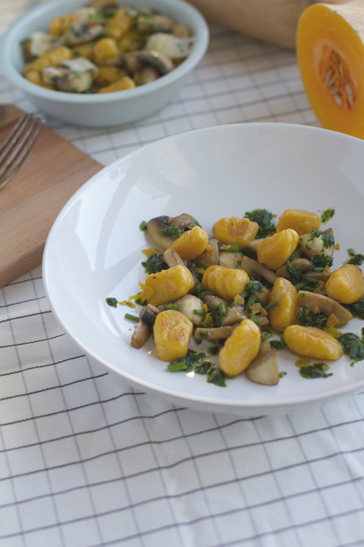

---
tags:
  - gnocchis
  - pomme de terre
  - butternut
  - farine T55
  - oeuf
  - muscade
---

# Gnocchis butternut

## Ingrédients (2-3 pers.)

- 200g de pomme de terre
- 200g de courge butternut
- 200g de farine T55
- 1 jaune d'oeuf
- De la muscade
- Du sel

## Recette

- Faites chauffer votre four sur 180°C
- Préparez vos pommes de terre en papillote de manière à les faire cuire au four pendant une heure et placez votre courge butternut dans un plat allant au four et laissez la cuire pendant 40min.
- Une fois vos ingrédients cuits, récupérez leurs chairs à l'aide d'une cuillère et faites en une purée.
- Lorsque que votre purée est lisse, laissez-la refroidir un petit peu avant d'y ajouter le jaune d'oeuf pour éviter qu'il ne cuise.
- Ajoutez une demi-cuillère à café de sel et de la muscade (une pincée sera suffisante).
- Ajoutez ensuite la farine et travaillez la pâte à la main.
- Lorsque le mélange devient humide, arrêtez de travailler.
- Séparez la boule en plusieurs pâtons et farinez votre plan de travail.
- Réalisez des boudins de 2 cm de diamètre, puis détaillez vos gnocchis.
- Mettez votre eau de cuisson à bouillir avec un peu de sel et préparez également un saladier rempli d'eau froide sur votre plan de travail.
- Pendant ce temps, faites rouler vos gnocchis sur le dos d'une fourchette pour créer leurs fameuses rayures.
- Vous pouvez maintenant passer à la cuisson de vos gnocchis. Faites les glisser dans l'eau et dès qu'ils remontent à la surface ils sont cuits !
- Récupérez-les avec votre écumoire et mettez-les dans l'eau froide. Une fois tous les gnocchis cuits, égouttez-les.

## Source

[besly.fr](http://www.besly.fr/gnocchis-a-la-courge-butternut/)
