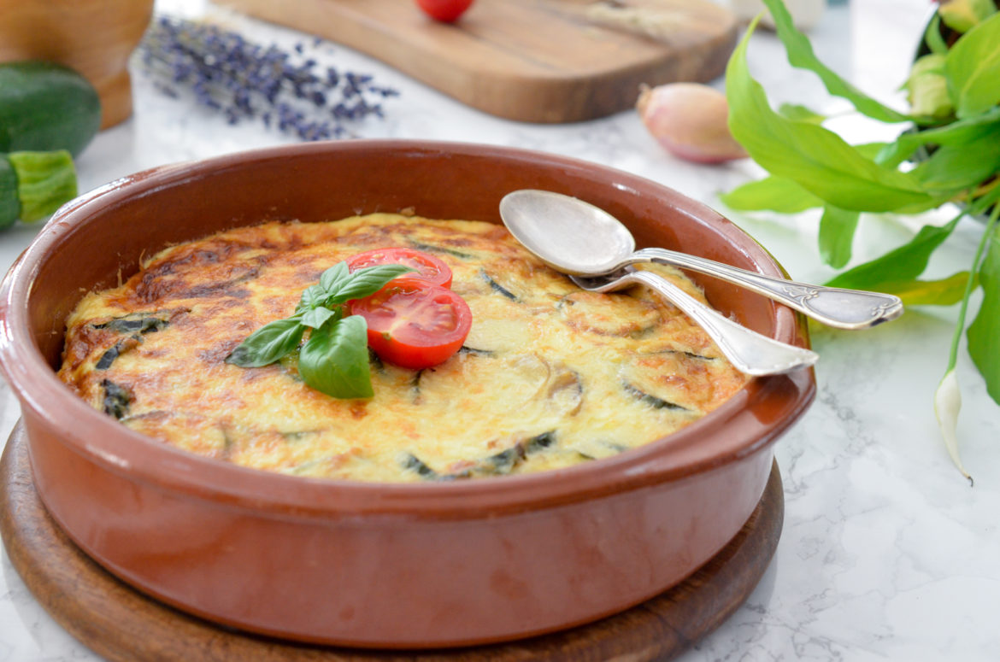

---
tags:
    - gratin
    - courgettes
    - oignon
    - échalote
    - mascarpone
    - crème
    - œufs
    - lait
    - comté
---

# Gratin de courgettes au mascarpone

- Nombre de personnes : 4
- Préparation : 15 min
- Cuisson : 40 min

## Ingrédients

- 500g de courgettes
- 1 oignon
- 1 échalote
- 150gr de mascarpone
- 10cl de crème fraîche
- 2 œufs
- 1/2 verre de lait
- 80g de comté râpé

## Préparation

- Préchauffez le four à 180°C.
- Lavez et coupez les courgettes en rondelles.
- Dans une poêle avec un filet d’huile, faites fondre l’oignon et l’échalote émincé.
- Ajoutez les courgettes, et poursuivez la cuisson 10 minutes. Salez, poivrez.
- Dans un grand bol, battez les œufs avec le mascarpone, la crème fraîche et le lait. Salez, poivrez.
- Disposez les courgettes dans un plat à gratin huilé. Versez la préparation au mascarpone sur le dessus. Saupoudrez de fromage râpé et enfournez 30 minutes.
- Dégustez chaud ou tiède.

## Astuces

- Incorporez du thon, du saumon, du chorizo ou des petits lardons pour en faire un plat complet
- Versez la préparation crue dans un pâte brisée pour obtenir une quiche gourmande, facile à transporter pour vos piques niques
- Ajoutez un zeste de citron ou des herbes fraiches (basilic, persil, menthe…) pour apporter un petit coup de peps
- Ajoutez d’autres légumes du soleil à votre préparation tels que des poivrons, de l’aubergine, des tomates…

## Source

[www.lespepitesdenoisette.fr](https://www.lespepitesdenoisette.fr/les-recettes/gratin-de-courgettes-au-mascarpone/)
